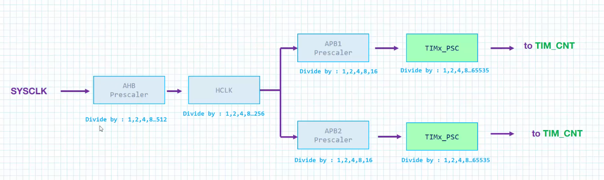

# Section 6. General Purpose Timers

## Timers vs. Counters

- Timers are internal clock sources, like a PLL, XTAL
- A Counter is a external clock source fed to the CPU.


## Timer use cases

- We can generate a time base (a time reference)
- We can measure the frequency of an extern event (called **input capture mode**)
- Control an output waveform, o rindicate when a period of time has elapsed (called **output compare mode**)
- **one pulse mode (OPM)** allows the conuter to be started in response to a stimulus and to generate a pulse with programmable length after a certain delay.

## Timer Registers

- **Timer Count Register (TIMx_CNT)**, which shows the current counter value. It could be 32 or 16 bits depending on the timer module used.
- **Timer Auto-Reload register(TIMx_ARR)** timer will raise a flag, and the conuter will restart automatically once the counter reaches the value specified in the auto reload register.
    - when the counter reaches this value, it'll set the flag, and invoke an interrupt.
- **Timer Prescaler Register (TIMx_PSC)**: this will slow down the counting speed of the timer by dividing the input clock of the timer.

## Timer Clock prescaling process

- The SYSCLK is divided alot via many prescalers.



## vocabulary

- Update event: when timeout occurs, or how long it takes for flag to be raised
- period: value loaded into auto-reload register
- up counter: counts from zero to set value.
- down counter: counts from a set value down to zero.

## calculating time it takes to trigger timer update event

```
update event = (timer clock) / ((prescaler + 1)(period + 1))
```

- we divide the timer clock by the prescaler, then by the period.

## commonly used Timer Registers

- PSC is the prescaler register.
    - we store the timer prescale value.
- ARR is the auto reload register.
    - when the TIM restarts, it'll automatically reload the ARR value.
- CR1 is the control register:
    - it can enable/disable the timer.
- SR is the status register
    - lets us check, set and clear flags of the timer.
- Capture Compare Registers (CCR1, CCR2, CCR3, CCR4)
    - Each channel with have a capture compare register.
    - it lets us readthe captured timer value.
- Capture Compare Mode Register (CCMRx)
    - CCMR1 configures the capture/compare functionality for CH1 and CH2.
    - CCMR2 configures the capture/cmompare functionality for CH3 and CH4.
- Capture Compare Enable Register (CCER):
    - used to enable any of the timer channels as input or output compare.
- Control Register 2 (CR2):
    - enables/disables ADC.


## STM32 Timer Configuration (Register-Level)

**Basic time base**

* Enable TIMx clock in RCC
* Set prescaler `PSC` → timer_clk = clk / (PSC+1)
* Set auto-reload `ARR` → overflow period = (ARR+1)/timer_clk
* Clear counter `CNT`
* Enable timer (`CR1.CEN`)

**Running / timing events**

* Poll `SR.UIF` for overflow (clear after handling), or use interrupts
* clear the UIF bit.

**Output Compare (event / PWM)**

* Set compare value `CCRx`
* Configure OC mode (`CCMRx.OCxM`)
* Enable channel output (`CCER.CCxE`)
* Set GPIO to Alternate Function (TIMx_CHx)
* Timer triggers action when `CNT == CCRx`

**Input Capture (measure signals)**

* Configure IC mode (`CCMRx.CCxS`)
* Select edge (rising/falling via `CCER`)
* Enable capture channel (`CCER.CCxE`)
* Set GPIO to Alternate Function (TIMx_CHx)
* On edge, `CNT` is latched into `CCRx`

**Key ideas**

* `PSC + ARR` define timing
* `UIF` = counter overflow
* `CCRx` = compare or captured timestamp
