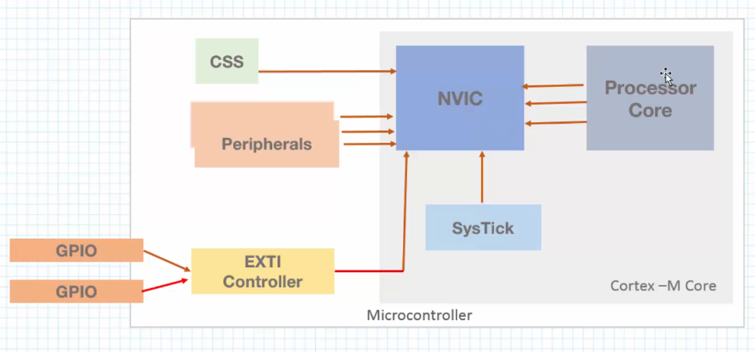

# Section 7: Interrupt Programming

## Interrupts vs. Polling

- Polling means  you'll actively check the state of something
- An interrupt will have the device interrupt the CPU, so you don't need to actively check.


- For example, you can enable an interrupt for a button, where if it's pressed, it'll activate an interrupt handler.

## Interrupt Service Routine (ISR)

- These are functions that get executed when an interrupt occurs.

## Nested Vector Interupt Controller (NVIC)

- This is hardware inside the cortex microcontroller
    - it's responsible for handling interrupts.



- all modules are connected to the NVIC
    - The CPU can invoke interrupts, and communicates with the NVIC.
- Other peripherals also generate interrupts.

## Exceptions vs Interrupt Requests

- Exceptions are interrupts from the process core (CPU)
- Interrupt Requests (also known as hardware exceptions) are interrupts from outside the processor core.

## Vector Table

- The vector table contains the address of interrupt and exception handlers

## External Interrupt Lines

- GPIO pins are connected to EXTI lines
- we can enable interrupts for any GPIO pins.
- multiple pins will share the same line.
    - if cannot have separate interrupts for 2 pins using the same EXTI line.

- some EXTI pins will have the same IRQ inside the Vector table, so the application will be responsible to differentiate which EXTI triggered the IRQ.

## Interrupt states

- disabled: default state
- enabled: occurs when the interrupt enabled
- pending: interrupt is waiting to be serviced
- active: interrupt being serviced.

## Interrupts - Priorities

- Priorities let us set which interrupts should execute first
- Priorities also let us define which interrupts can interrupt what.

- There are some interrupt priorities defined by ARM
    - RESET has a priority of -3
    - NMI has a priority of -2
    - HardFault has a priority of -1

- The lower the number, the higher the priority.

## IPR registers

- These are the Interrupt Priority Registers, where the interrupt priorities are defined
    - Each IRQ will use 8 bits in a single IPR register.
    - hence, each IPR register will store four different priorities
    - There are a total of 60 IPR registers, meaning there's a total of 240 interrupts.

- The STM32 will only use the upper four bits to configure the priority of each IRQ.
    - this means there's a total of 16 priority levels.

- since we use the upper four bits, we need to left shift the priority by 4.
- We can alternatively do `NVIC_SetPriority(TIM2_IRQn, 3)`

## Sub Priorities

- Priorities let us choose which IRQ to handle first.
    - This brings up a question, what if we get multiple IRQs of the same priority at the same time.
- We introduce sub priorities:
    - there are multiple bits defining preemption priority, and sub priority.

## Configuring gpio input interrupt

```c
#define GPIOCEN (1U << 2)
#define GPIOC13 (3U << 26)
#define EXT13EN (2U << 8)

void init_exti_interrupt(void)
{
	/* disable irqs */
	__disable_irq();

	/* enable global clock access for GPIOC */
	RCC->IOPENR |= GPIOCEN;

	/* enable SYSCFGEN clock */
	RCC->APBENR2 |= (1U << 0);

	/* configure PC13 as input */
	GPIOC->MODER &= ~GPIOC13;

	/* connect PC13 to ext13 */
	EXTI->EXTICR[3] &= ~(0xFFU << 8);  // Clear EXTI13 field
	EXTI->EXTICR[3] |= EXT13EN;

	/* unmask exti being used */
	EXTI->IMR1 |= (1U << 13);

	/* select rising edge trigger */
	EXTI->RTSR1 |= (1U << 13);

	/* enable ext13 line in NVIC */
	NVIC_EnableIRQ(EXTI4_15_IRQn);
	/* enable irqs*/
	__enable_irq();
}
```
- when you start, you need to disable irqs, and enable irqs at the end.
- First, we need to enable the clock for the GPIO we want to use, and configure it as input.
- Second, we connect PC13 to the exti line, 13.
- unmask the exti line being used.
- select when the interrupt be invoked (rising or falling edge).
- enable the ext13 in NVIC


**handler**

```c
void EXTI4_15_IRQHandler(void) //you need to name it specifically, as this is the function name in the interrupt vector table
{
    // Check if EXTI13 triggered the interrupt
    if(EXTI->RPR1 & (1U << 13))
    {
        // Clear the pending bit by writing 1 to it
        EXTI->RPR1 |= (1U << 13); //we write 1 to it, not zero
        GPIOA->ODR ^= (1U << 5); //just toggle gpioa5.
        printf("interrupt invoked\n\r"); //print statement.
    }
}
```

## configuring USART interrupt

- First, enable USART by using the `CR1` register to enable when to invoke interrupt
- Second, enable the USART2 interrupt in the NVIC.

## configuring ADC interrupts

- You can do this by configuring the ADC's control register to enable interrupts
- Enable the ADC interrupt in the NVIC

## Configuring systick and timer interrupt

- Like the other interrupts, enable interrupts in the control register and enable the interrupt in the NVIC
