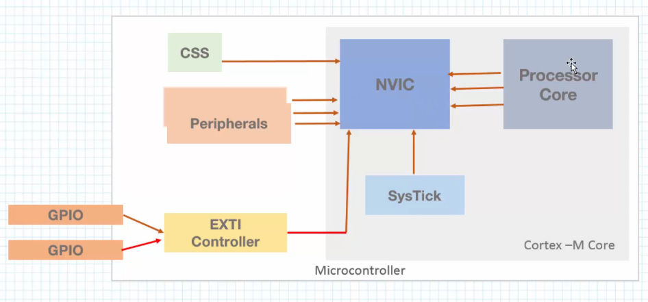

# Section 7: Interrupt Programming

## Interrupts vs. Polling

- Polling means  you'll actively check the state of something
- An interrupt will have the device interrupt the CPU, so you don't need to actively check.


- For example, you can enable an interrupt for a button, where if it's pressed, it'll activate an interrupt handler.

## Interrupt Service Routine (ISR)

- These are functions that get executed when an interrupt occurs.

## Nested Vector Interupt Controller (NVIC)

- This is hardware inside the cortex microcontroller
    - it's responsible for handling interrupts.



- all modules are connected to the NVIC
    - The CPU can invoke interrupts, and communicates with the NVIC.
- Other peripherals also generate interrupts.

## Exceptions vs Interrupt Requests

- Exceptions are interrupts from the process core (CPU)
- Interrupt Requests (also known as hardware exceptions) are interrupts from outside the processor core.

## Vector Table

- The vector table contains the address of interrupt and exception handlers

## External Interrupt Lines

- GPIO pins are connected to EXTI lines
- we can enable interrupts for any GPIO pins.
- multiple pins will share the same line.
    - if cannot have separate interrupts for 2 pins using the same EXTI line.

- some EXTI pins will have the same IRQ inside the Vector table, so the application will be responsible to differentiate which EXTI triggered the IRQ.

## Interrupt states

- disabled: default state
- enabled: occurs when the interrupt enabled
- pending: interrupt is waiting to be serviced
- active: interrupt being serviced.

## Interrupts - Priorities

- Priorities let us set which interrupts should execute first
- Priorities also let us define which interrupts can interrupt what.

- There are some interrupt priorities defined by ARM
    - RESET has a priority of -3
    - NMI has a priority of -2
    - HardFault has a priority of -1

- The lower the number, the higher the priority.

## IPR registers

- These are the Interrupt Priority Registers, where the interrupt priorities are defined
    - Each IRQ will use 8 bits in a single IPR register.
    - hence, each IPR register will store four different priorities
    - There are a total of 60 IPR registers, meaning there's a total of 240 interrupts.

- The STM32 will only use the upper four bits to configure the priority of each IRQ.
    - this means there's a total of 16 priority levels.

- since we use the upper four bits, we need to left shift the priority by 4.
- We can alternatively do `NVIC_SetPriority(TIM2_IRQn, 3)`

## Sub Priorities

- Priorities let us choose which IRQ to handle first.
    - This brings up a question, what if we get multiple IRQs of the same priority at the same time.
- We introduce sub priorities:
    - there are multiple bits defining preemption priority, and sub priority.

## Configuring gpio input interrupt

1. disable global interrupt with `__disable_irq();`.
2. enable clock access for GPIO, and configure pin with `GPIOx_MODER`.
3. Enable clock access to SYSCFG (using `EXTICR` register)
4. Select gpio port for exti (using `EXTICR` register).
5. unmask exti being used (using `IMR` register).
6. select falling edge trigger (using `FTSR` register).
7. enable ext13 line in NVIC (using `NVIC_EnableIRQ()` macro), where you'd pass in the specific interrupt you want to handle (`EXT15_10_IRQn` for example).
8. enable global interrupt.

**writing handler**

- you'd need to name the interrupt handler as:

```c
void EXT15_10_IRQHandler(void);
```
- this is because the vector table will store a function called EXT15_10_IRQHandler
- Since other exti registers could use the same handler, you need to differentiate between them in software.
    - you can use the pending register to check which exti line device triggered the irq
- in the handler, you want to clear the pending request flag that's set. This is by setting it to 1.
