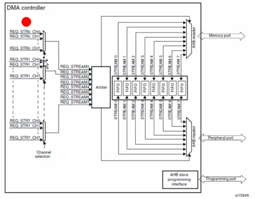
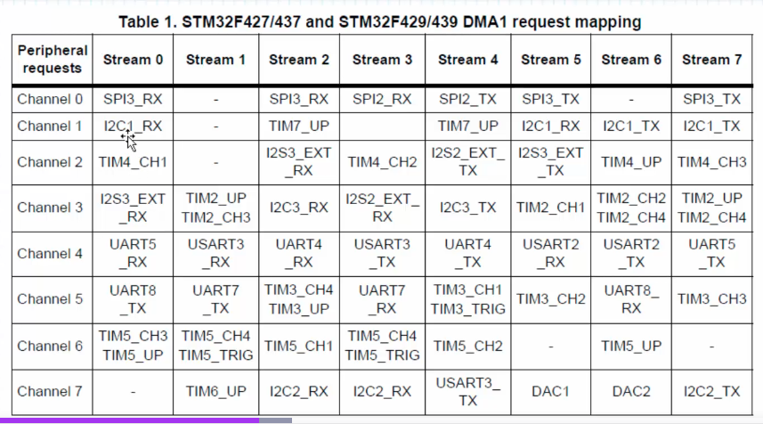

# Section 8. Direct Memory Access (DMA) Driver Development

## What is DMA?

- DMA is Direct Memory Transfer, allowing for data transfer without cpu intervention.
    - this allows the cpu to do other tasks, and is only interrupted when the entire data block is available for processing.

## DMA Controller

- The DMA Controller is the hardware responsible for handling DMAs
- The STM32 contains 2 DMA modules.
    - each model will have 8 different streams.
    - each stream is didecated to managing memory access requests from one or more peripherals.

## DMA - Streams

- we have 8 streams in our DMA controller
- Each stream allows up to 8 selectable channels.
    - we can assign which channel is connected to the stream.
- the stream goes through a "Arbiter", which handles priority levels.
    - there are four levels. If the streams has the same priority level, the arbiter will resort to the hardware priority level. 



- Each channel correlates with DMA capabilities for a certain peripheral (I2C for example).



## DMA - Source + Destination Address

- We define a DMA transfer with a source and destination address.
    - these addresses should be wethin the AHB or APB memory range.

## DMA - Transfer Modes

- There are three main transfer modes:
    - Peripheral to Memory
    - Memory to Peripheral
    - Memory to memory (only available on DMA2 modules.)

## DMA - Transfer Size

- this is the number of bytes we actually transfer from source to destination
- We only define this when the DMA is the flow controller.

## DMA - incrementing Addresses

- DMA can automatically increment source and destination address after each transfer.
    - think like doing DMA on an array.

## DMA - Data Width

- We can define the width of each piece of data:
    - byte: 8 bits
    - half word: 16 bits
    - word: 32 bits.

## DMA - Transfer Type

- circular mode: The DMA_SxNDTR register is reloaded automatically with the previously programmed value.
- normal mode: once the DMA_SxNDTR register reaches zero, the stream is disabled.

## DMA - FIFO Mode

- Each stream will have a 4 word "FIFO"
- The FIFO temporarily stores data coming from the source before transmitting to the destination.
- If this mode is enabled, data packing/unpacking and Burst mode can be used.
- the DMA FIFO threshold defines the DMA memory port request time.

**why use FIFO?**

- This will reduce the numbe of ram access, giving other devices to access the bus matrix without additional concurrency.
- Allows software to do burst transaction which will optimize the transfer bandwidth.
- allow packing/unpacking data to adpt source and destination data width with no extra DMA access.

## Coding DMA Driver

```c
void init_usart_tx_driver()
```