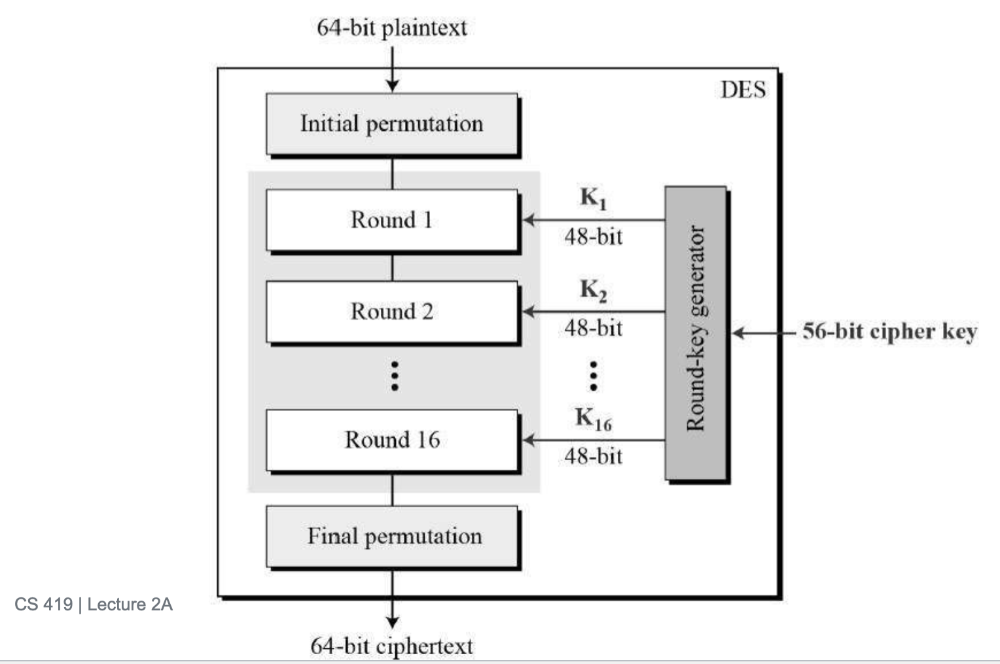

# Lecture 2 - encryption

## what is cryptography?

- Cryptography is the practice and study of techniques for secure communication in the presence of adversaries.

## goals of cryptography

- confidentiality
- data integrity

## basic cryptography terminology

- plain text: original message
- encryption (E): C = E(K,P)
    - encryption is some sort of algorithm that converts your plain text into cipher text.
- cipher text is the encrypted message.
- decryption: convert cypertext to plain text: P = D(K,C)

## Kerckoff's Principle

- A cryptosystem should be secure even if everytihng about the system, except the key is public knowledge
    - in other words, we could crack the algorithm, but it won't mean anything if the key is still not known.

## symmetric encryption

- With this approach, we'll use the same key for encryption and decryption.

- this is fast and efficient, and good for large data
- the problem with this approach is:
    - it doesn't exactly scale, as there are more people.

- five components:
    - plaintext
    - encryption algorithm
    - secret key
    - ciphertext
    - decryption algorithm.

- security requirements:
    - needs to be a strong algorithm.

## symetric encryption attacks:

- one potential incident is:
    - person can get original plain text, and encrypted text.
        - you can deduce the encryption key seeing how it's encrypted.
    - you can create plaintext, and encrypt it to cypertext, to deceive the recipient.

## caeser cipher

- This is the symmetric encryption algorithm.

- shift the letters by some key K.

```
plaintext: MEET AT NOON
ciphertext: PHHW DW QRRQ
```
- encryption: $C = (P + k) mod 26$
- decryption: $P = (C - k) mod 26$
    - note P is plain text, C is cipher, k is the key.
- problem is, there are 25 possible keys, you can brute force in seconds.

## Monoalphabetic Substitution Cipher

- Here, each letter will map to another.
- there are more combinations available, `26!`.
- you can break it by looking at the frequency of letters.
    - you can use statistical properties to crack this method.

## Transposition ciphers

- here, you take the plain text, alternate it, then get the order

```
HELLO
|
H L O
 E L
|
HLLOEL
```

- you can see a pattern, and decrypt it easily.

## block cipher fundamentals

- encrypt fixed size blocks of plain text.
- characteristics:
    - fixed block size (DES: 64 bits, AES: 128 bits)
- same keys are required for all blocks.
- requires modes of operations for multiple blocks.

## Shannon's Princples

- there are two aspects to a good encryption algo:
    - confusion: complex relationship between key and ciphertext. You can achieve. this through substitution.
    - diffusion:
        - spead plaintext influence throughout ciphertext.
        - you can achieve this with permutation.

## S-Boxes vs. P-Boxes

- S-Box is made to create confusion.
    - if you're input one, the s box might be programmed to output 0100
    - it's non linear.
- P-box is made for diffusion:
    - how it works: if you have our bits in position 1, 2, 3 and 4, a p-box can move bit 1 to position 3, 2 to 4, so on.

## Feistel Cipher Structure

- here, we'll divide blocks into two halves (L and R)
- process through multiple rounds
    - each round:
        - function on one half
        - xor with other
        - swap

## DES algorithm

- Process:
    - an initial permutation
    - perform 16 rounds of feistel
    - the final permutation

- problems with DES:
    - you can easily brute force, and find the key in hours nowadays.
- DES is deprecated, triple DES was the replacement

## Triple DES algorithm

- here, we applied DES three times (3DES)
    - steps:
        - encrypt Plain Text with K1.
        - decript cipher text with K2.
        - Encrypt cipher text again with K3, then send to user.
- We don't encrypt three times, the second iteration will decrypt the original cipher text, so you'd end up sending a regular DES to the recipient.

## round key generation

- given a 56 bit cipher key, it'll vary the subkey for 16 rounds to turn the initial plain text into cipher text.



## three types of P-Boxes

- straight: n bits in -> n bits out
- expansion: n bits in -> m bits out (m > n)
- compression: n bits in -> m bits out (m < n)

## why is data loss okay?

- the key schedule
    - the receiving person has the full key, there's no need for the whole thing. They could compress the key on their end, and use that te decrypt the cipher text.
- inside the round function
    - realistically, data isn't being lost, but combined.

## security benefits of data loss

- Because it's compressed, the attacker, can't recover the lost data.