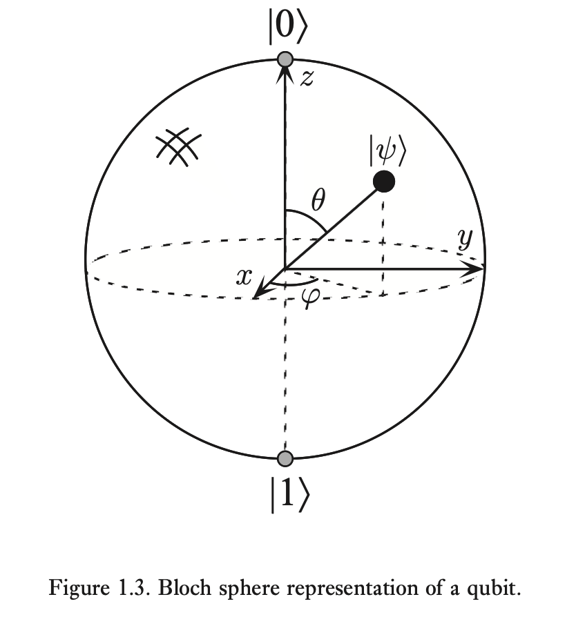

# 1. Fundamental Concepts

## what is quantum computation and quantum information

 The study of information processing tasks that can be accomplished with quantum mechanical systems.

 ## what is quantum mechanics?

 - A mathematical framework or set of rules for the construction of physical theories.

 ## quantum bits

 - bits are the fundamental concept for classical computers
 - Quantum computation and information are built upon **quantum bits**
 - a **qubit** is simply a state.
    - there are two states: $\ket{0}$ and $\ket{1}$
        - these are **computational basis states**
    - it's different from classical computing, because qubits can be in additional states beside $\ket{0}$ and $\ket{1}$

## superpositions

- these are linear combination of states

- for example, $\ket{\psi} = \alpha \ket{0} + \beta \ket{1}$
    - where $\alpha$ and $\beta$ are complex numbers.

## probabilities in quantum

- we cannot get the quantum state of a qubit,
    - instead, we get the probabilities for the two states.
- we can get $\ket{0}$ with probability $|\alpha|^2$, or $\ket{1}$ for $|\beta\^2$

### example

$\frac{1}{\sqrt{2}}\ket{0} + \frac{1}{\sqrt{2}} \ket{1}$

$\alpha = \frac{1}{\sqrt{2}} \\ \alpha^2 = \frac{1}{\sqrt{2}} \times \frac{1}{\sqrt{2}} = \frac{1}{2}$

therefore, $\ket{0}$ and $\ket{1}$ has a 1/2 probability of being either state.

## qubit geometric representation

- We can represent qubits in the geometric representation

$\ket{\psi} = \cos{\frac{\theta}{2} \ket{0}} + e^{i\varphi} \sin{\frac{\theta}{2}}\ket{1}$

## multiple qubits

- similar to bits, you can have multiple qubits
    - they include: $\ket{00}, \ket{01}, \ket{10}, \ket{11}$
    - there can also be superpositions of these staets.

- in the end, we describe the state vector with two qubits as $\ket{\psi} = \alpha_{00} \ket{00} + \alpha_{01} \ket{01} + \alpha_{10} \ket{10} + \alpha_{11} \ket{11}$

- lets say we want to measure the first qubit, giving us the probability of $|\alpha_{00}|^2 + |\alpha_{01}| ^ 2$, which no longer adds up to one. We need to normalize this, which will give us the following:

- $\ket{\psi'} = \frac{\alpha_{00} \ket{00} + \alpha_{01} \ket{01}}{\sqrt{|\alpha_{00}|^2 + |\alpha_{01}| ^ 2}}$

## quantum gates 

- A classical computer is built off wires and logic gates.
- on quantum, we have have wires and quantum gates.

## quantum not gate

- in digital computing, a NOT gate will invert 1 to 0 and vice versa.

- the quantum gate will take $\alpha \ket{0} + \beta \ket{1}$, and convert it to $\alpha \ket{1} + \beta \ket{0}$.

- we can represent the NOT gate as a matrix:
    - $\begin{bmatrix}0 & 1 \\ 1 & 0\end{bmatrix}$

$$
\begin{bmatrix}0 & 1 \\ 1 & 0\end{bmatrix}
\begin{bmatrix}\alpha \\ \beta \end{bmatrix}
=
\begin{bmatrix}\beta \\ \alpha\end{bmatrix} \\
= \alpha\begin{bmatrix}0 \\ 1\end{bmatrix} + \beta\begin{bmatrix}1 \\ 0\end{bmatrix} \\
= \alpha\ket{1} + \beta\ket{0}
$$

## U matrix, adjoint

- these are 2 by 2 matrices.
- $U^\dagger$ is the adjoint of matrix U
    - this means we transpose, and get the complex conjugate
- $UU^\dagger = I$
$$
U =
\begin{bmatrix}
a & b \\
c & d
\end{bmatrix} \\
U^\dagger =
\begin{bmatrix}
a* & c* \\
b* & d*
\end{bmatrix}
$$

## Z gate

- The Z gate is depicted with:

$$
Z = \begin{bmatrix}
1 & 0 \\
1 & -1
\end{bmatrix}
$$

applying the z gate to a matrix will give us:

$$
\begin{bmatrix}
1 & 0 \\
0 & -1
\end{bmatrix}
\begin{bmatrix}
\alpha \\
\beta
\end{bmatrix}
=
\begin{bmatrix}
\alpha + 0\beta \\
0\alpha - \beta
\end{bmatrix}
$$

$$
\alpha
\begin{bmatrix}
1 \\
0
\end{bmatrix}
- \beta
\begin{bmatrix}
0 \\
1
\end{bmatrix}
$$

$$
\alpha\ket{0} - \beta\ket{1}
$$

## hadamard gate

$$
H \equiv
\frac{1}{\sqrt{2}}
\begin{bmatrix}
1 & 1 \\
1 & -1
\end{bmatrix}
$$

applying the hadamard gate will look like the following:

$$
\frac{1}{\sqrt{2}}
\begin{bmatrix}
1 & 1 \\
1 & -1
\end{bmatrix}
\begin{bmatrix}
\alpha \\
\beta
\end{bmatrix}
=
\frac{1}{\sqrt{2}}
\begin{bmatrix}
\alpha + \beta \\
\alpha - \beta
\end{bmatrix}
$$

$$
=
\frac{\alpha}{\sqrt{2}}\begin{bmatrix}
1 \\ 1
\end{bmatrix}
+ 
\frac{\beta}{\sqrt{2}}
\begin{bmatrix}
1 \\
-1
\end{bmatrix}
$$

$$
= \alpha \frac{\ket{0} + \ket{1}}{\sqrt{2}} + \beta \frac{\ket{0} - \ket{1}}{\sqrt{2}}
$$

## CNOT gate

- The CNOT gate is the Controlled not gate.
    - there are two input qubits: control and target qubit

$$
\begin{bmatrix}
1 & 0 & 0 & 0 \\
0 & 1 & 0 & 0 \\
0 & 0 & 0 & 1 \\
0 & 0 & 1 & 0 \\
\end{bmatrix}
$$

$\ket{A, B} \rightarrow \ket{A, B \oplus A}$