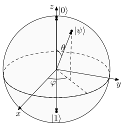

# exercise 4.1

In Exercise 2.11, which you should do now if you haven’t already done
it, you computed the eigenvectors of the Pauli matrices. Find the points on the
Bloch sphere which correspond to the normalized eigenvectors of the different
Pauli matrices.

- for any pure state, we can write it via two angles: $\phi$ and $\theta$.
    - we can express the pure state as: $\ket{\psi} = \cos(\frac{\theta}{2})\ket{0} + e^{i\phi} \sin(\frac{\theta}{2}) \ket{1}$

to compute the cartesion coordinates, we can do:

$$
(x,y,z) = (\sin(\theta)\cos(\phi),\sin(\theta)\sin(\phi),\cos(\theta))
$$

for the paul matrix