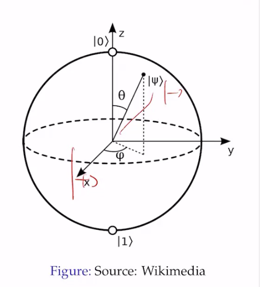

# lecture 2: introduction

- in QC, we have various aspects of QC:
    - states
    - gates
    - protocols
    - algortihms
    - repetition

## QECC
- Quantum Error Correction Code
- This is the main focus in 2026.

## Quantum mechanics - postulates

- Fourset of principles to build an understanding of quantum computing:
    - state space
    - composite system
    - evolution
    - quantum measurement.


```
    - state space. --------------------
    - composite system                | closed Quantum Systems
    - evolution  ----------------------
    - quantum measurement (non linear and describes open quantum system.)
````

- state space - how are quantum states described.
- composite systems: how do we put the states together.
- evolution: how do qubits evolve.
- quantum measurement: once you let the qubit interract with the interaction, what does the qubit state look like?
    - We want to get information out the quantum state.

## QIP vs. QM

- QIP = Quantum Information Processing
    - treat as discrete state, and time
- QM = Quantum Mechanics:
    - continuous time and continuous state.

## state of a single qubit

```
What is the qubit state represented by the geographical location of Old Queens?
```
- what exactly does this question mean?

## Transition from physics to discrete


- first we need to transition from a continuous state space to a discrete state space

- before, we assumed a continuous state space:
    - $| \psi > \int^\infty _{-\infty} \Psi (x) | x> dx$, there's no limit.
- after, we assume a discrete state space:
    - $|\psi > = \sum ^\infty _{i = 0} \pi (x_i)|x_i>$

- here, we're transitioning from the continuous state space to a discrete state space.

**Next, we need to go from a descrete state space to a discrete binarized state space**

- we first assume a discrete state space
    - $| \psi > = \sum^\infty _{i = 0} \psi (x_i) | x_i >$
- we can then transition nto the discrete binary state space:
    - $|\psi > = \sum^1 _ {i = 0} \psi (x_i) | x_i >$,
        - which says we assume combinations of two states.

## binary abstraction

- we have two states in quantum computer

- there's high and low voltage

- we have two main states:
$$
\begin{bmatrix}
1 \\
0
\end{bmatrix} = \ket{0}, \text{ which we call "ket" 0}

\begin{bmatrix}
0 \\
1
\end{bmatrix} = \ket{1}, \text{ which we call "ket" 1}
$$

**is this just the binary abstraction on QC, or just classical computing.**

## derag notation
the $\ket{1}$ is known as bra ket notation

$\ket{0} = \begin{bmatrix} 1 \\ 0\end{bmatrix}$

$\bra{0} = \begin{bmatrix} 1 & 0 \end{bmatrix}$ 

$\bra{0} \ket{0} = \begin{bmatrix}1 & 0\end{bmatrix}\begin{bmatrix}1 \\ 0\end{bmatrix} = 1$

$\bra{1} \ket{0} = \begin{bmatrix}0 & 1\end{bmatrix}\begin{bmatrix}1 \\ 0\end{bmatrix} = 0$

## NOT gate

lets say we have the following matrix, $X = \begin{bmatrix}0 & 1 \\ 1 & 0\end{bmatrix}$

$X \ket{0} = \begin{bmatrix}0 & 1 \\ 1 & 0\end{bmatrix}\begin{bmatrix}1 \\ 0\end{bmatrix} = \begin{bmatrix}0 \\ 1\end{bmatrix} = \ket{1}$

$X \ket{1} = \begin{bmatrix}0 & 1 \\ 1 & 0\end{bmatrix}\begin{bmatrix}0 \\ 1\end{bmatrix} = \begin{bmatrix}1 \\ 0\end{bmatrix} = \ket{0}$


## hadamard gate

- the hadamard operator is the matrix $H = \begin{bmatrix}\frac{1}{\sqrt{2}} & \frac{1}{\sqrt{2}} \\ \frac{1}{\sqrt{2}} & \frac{-1}{\sqrt{2}}\end{bmatrix}$
    - $H \ket{0} = \begin{bmatrix}\frac{1}{\sqrt{2}} & \frac{1}{\sqrt{2}} \\ \frac{1}{\sqrt{2}} & \frac{-1}{\sqrt{2}}\end{bmatrix} \begin{bmatrix}1 \\ 0\end{bmatrix} = \begin{bmatrix}\frac{1}{\sqrt{2}} \\ \frac{1}{\sqrt{2}}\end{bmatrix} = \frac{1}{\sqrt{2}} \ket{0} + \frac{1}{\sqrt{2}} \ket{1}$
    - $H \ket{0} = \begin{bmatrix}\frac{1}{\sqrt{2}} & \frac{1}{\sqrt{2}} \\ \frac{1}{\sqrt{2}} & \frac{-1}{\sqrt{2}}\end{bmatrix} \begin{bmatrix}0 \\ 1\end{bmatrix} = \begin{bmatrix}\frac{1}{\sqrt{2}} \\ \frac{-1}{\sqrt{2}}\end{bmatrix} = \frac{1}{\sqrt{2}} \ket{0} - \frac{1}{\sqrt{2}} \ket{1}$

- This matches the idea of the photon detector thing pretty well. It's probabilistic in nature.
- We usually pass our value into multiple gates to get a final value.

```
       +---+
|0>----| H |--|+>
       +---+
```

## superposition

- in a single qubit state, you have matrices n stuff.

- there are other physical phenomena that can be used to represent qubits.

## phase shift gate

- represented via $Z = \begin{bmatrix}1 & 0 \\ 0 & -1\end{bmatrix}$

- $Z \ket{0} = \begin{bmatrix}1 & 0 \\ 0 & -1\end{bmatrix} \begin{bmatrix}1 \\ 0\end{bmatrix} = \begin{bmatrix}1 \\ 0\end{bmatrix} = \ket{0}$
- $Z \ket{1} = \begin{bmatrix}1 & 0 \\ 0 & -1\end{bmatrix} \begin{bmatrix}0 \\ 1\end{bmatrix} = \begin{bmatrix}0 \\ -1\end{bmatrix} = - \ket{1}$

## Bloch Sphere

we can represent the pure state of a single qubit with:

- $\ket{\psi} = cos \frac{\theta}{2}\ket{0} + e^{i\phi} sin \frac{\theta}{2} \ket{1}$
    - $\theta$ is the polar angle
    - $\phi$ is azimuthal angle

- euler's formula: $e^{i\phi} = cos\phi + isin\phi$

- this can be represented with a circle. pure states are on the surface. mixed are inside.



- $\ket{0}$ is like the north pole, for example.

### rotation around the bloch sphere

- $R_x (\theta) = cos\frac{\theta}{2} I - isin\frac{\theta}{2} X$
- $R_y (\theta) = cos\frac{\theta}{2} I - isin\frac{\theta}{2} Y$
- $R_y (\theta) = cos\frac{\theta}{2} I - isin\frac{\theta}{2} Z$