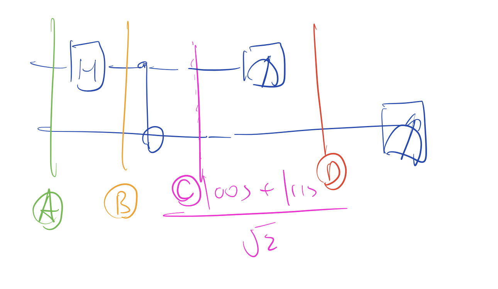

# Lecture 7 - stabilizer tableaus and Foundations of Deutsch's Algorithm

## stabilizer Tableau Formalism: A modern Algebraic Lens

- Using a state vector is unsustainable, as it doesn't scale well.
- To address this, stabilizer tableau view lets us describe a state only using n generators.

## stabilizer tableau: components

- a stabilizer tableau is a binary matrix representation of the Pauli Operator (I,X,Y,Z)

| Component | Strategic Function |
| --- | --- |
| n Generators | for n qubits, we only track n independent generators, generating a full stabilizer group (size $2^n$).
| X and Z columns | the tableau track X and Z basis to each component separately |
| phase column (R) | A dedicated column to track the sign ($\pm 1$) of each generator |
| gaussian elimination | We use diagonalization to isolate variables, providing a clean view of the state |

## tracing bell circuit

- A bell circuit is a hadamard followed by CNOT.
- it can be used as a testbed for simulating entanglement.

- we can put them in separate states: A, B and C.

- A, our initial state is $\ket{00}$: The state here is stabilized by Z on the first and second cubit, hence our generator is $\{ZI,IZ\}$.
- At point B, the hadamard gate is applied to $\ket{0}$ giving us $\ket{+}$
    - $\ket{+}$ is stabilized by X, so our new generator is $\{XI,IZ\}$
- at point C, we apply the CNOT gate:
    - for qubit one, it could be $\ket{0}$ or $\ket{1}$, which is stabilized by X
    - for qubit two, it could be $\ket{0}$ or $\ket{1}$, which is stabilized by Z

## mechanics of measurement and collapse

- measurements in the stabilizer view is intuitive, since we can determine deterministic and non-deterministic outcomes.
- When we measure in the $Z_0$ basis, we're evaluating the columns associated with the 0th top qubit.

## deterministic vs. non-deterministic

- **Deterministic Case**: If the measurement operator (e.g., Z) is already a stabilizer or generated by the tableau, the outcome is fixed.

- **Non-deterministic Case**: If a qubit is stabilized by an X generator (like the $\ket{+}$ state) but measured in Z, the state must collapse. This triggers a coin toss to determine the new phase R $(\pm1)$.

